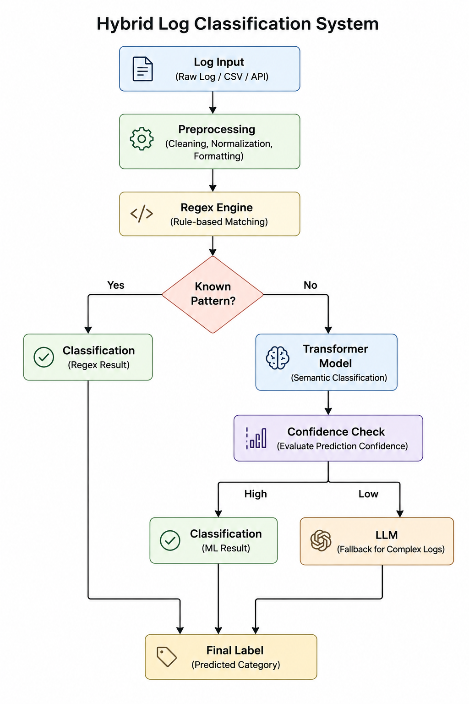

# AI-Powered Hybrid Log Classification System

> An intelligent log classification platform that combines rule-based pattern matching, semantic machine learning, and LLM-based classification to process application and system logs.

---

## Overview

Modern applications generate large volumes of logs from different sources, making manual analysis difficult and time-consuming.

This project implements a hybrid log classification pipeline that combines multiple classification techniques to handle both predictable and complex log patterns.

The system uses:

- Regex-based classification for known patterns
- Sentence Transformer embeddings for semantic classification
- Logistic Regression for supervised prediction
- LLM-based classification for ambiguous log messages
- FastAPI for exposing the classification pipeline through REST APIs

The hybrid architecture allows the system to use lightweight deterministic rules for known patterns while leveraging machine learning and language models for more complex logs.

---

<h2>System Architecture</h2>

  

